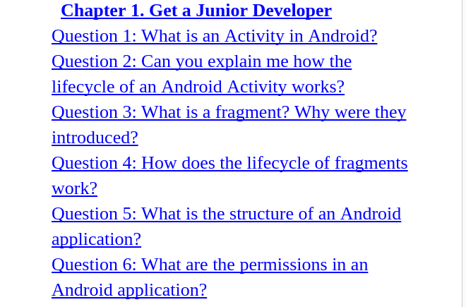
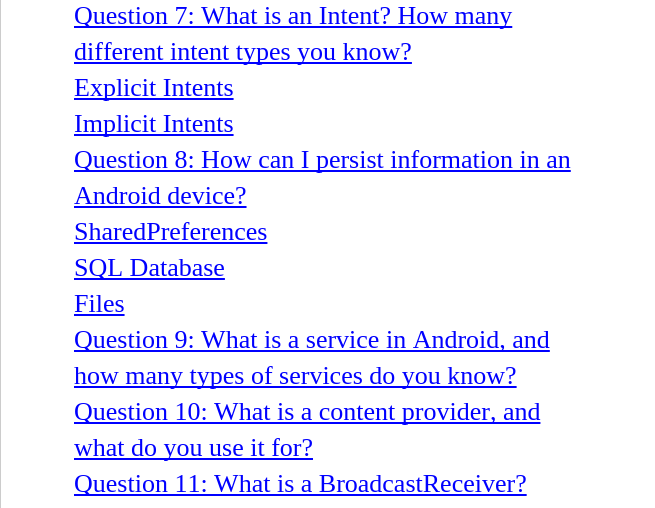
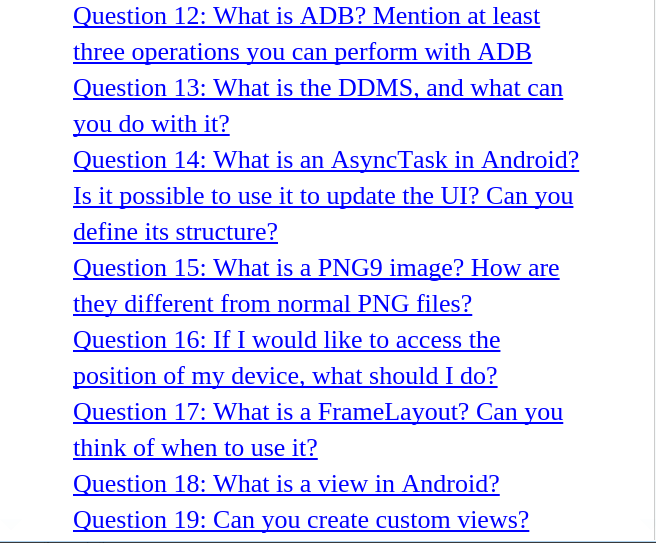
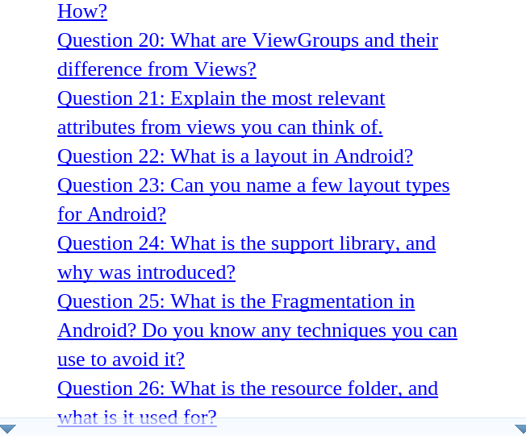
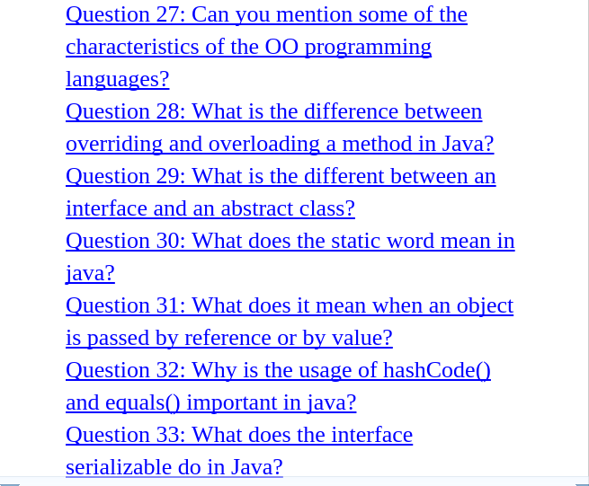
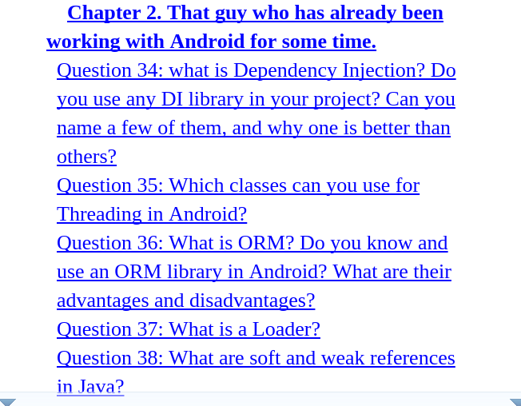
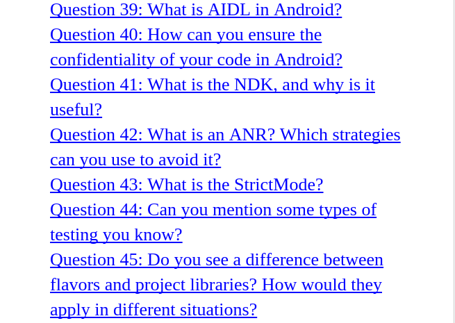
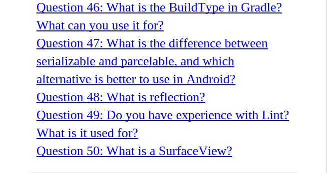

## Android Interview Questions
### About Android Framework.
---
+ The Android Framework is an important aspect of the Android Architecture.
+ Here you can find all the classes and methods that developer would need in order to write applications on the Android Environment.

## Activities, Tasks, and Intents
+ **Activities:** In Android, an activity is an application component that defines a screen of information and all of the associated actions the user can perform. Your app is a collection of activities, consisting of both the activities you create and those you re-use from other apps.

+ **Tasks:** A task is the sequence of activities a user follows to accomplish a goal. A single task can make use of activities from just one app, or may draw on activities from a number of different apps.

+ **Intents:** An intent is a mechanism for one app to signal it would like another app's assistance in performing an action. An app's activities can indicate which intents they can respond to. For common intents such as "Share", the user may have many apps installed that can fulfill that request.

Q. What is a Service.?
 +
(1). **Android Activity Lifecycle.**

(2). **Difference Between Explicit and implicit methods or intent ?**

(3). **What is difference between Serializable and Parcelable ?**

(4). **What is Activities ?**

(5). **What is Intent ?**

(6). **What is AVD ?**

(7). **What is meaning of Android Word ?**

*Answer:  it means a robot with a human appearance.*

(8). **What is Android?**

*Answer: an open-source operating system used for smartphones and tablet computers.*

(9). **Inventors of android ?**

*Answer: Andy Rubin, Rich Miner, Nick Sears*

(10). **ADT stand for ?**

*Android Developer Tools*

(11). **SDK stand for ?**

*Software Development Kit*

(12). **What is AIDL ?**

*AIDL is the abbreviation for Android Interface Definition Language.*
- It handles the interface requirements between a client and a service to communicate at the same level through interprocess communication.
- The process involves breaking down objects into primitives that are Android understandable.

(13). **Describe Android Application Architecture.**

*Android Application Architecture has the following components:*

  +  Services – like Network Operation
  +  Intent - To perform inter-communication between activities or services
  +  Resource Externalization - such as strings and graphics
  +  Notification signaling users - light, sound, icon, notification, dialog etc.
  +  Content Providers - They share data between applications

(14). **What are App Widgets?**

*Answer: Also referred to simply as Widgets, App Widgets in the Android world are miniature views that are embedded within Android apps and typically display periodic updates. Music players, weather updates, sports scores, and stock price changes are all examples of data that can be displayed in an App Widget.*

### Starting an Activity
+ [Activity Lifecycle ](http://developer.android.com/training/basics/activity-lifecycle/starting.html)

### Intents and Intent Filters
+ An Intent is a messaging object you can use to request an action from another app component.
+ There are three fundamental use-cases:
    + To start an activity:
    + To start a service:
    + To deliver a broadcast:

#### Intent Types
---
There are two types of intents:
+ Explicit intents
+ Implicit intents
+ [Intent](https://developer.android.com/guide/components/intents-filters.html)
### Content Providers
(15) **What is a ContentProvider and what is it typically used for?**

+ When you want to access data in a content provider, you use the `ContentResolver` object in your application's `Context` to communicate with the provider as a client. The `ContentResolver` object communicates with the provider object, an instance of a class that implements `ContentProvider`. The provider object receives data requests from clients, performs the requested action, and returns the results.

+ A `ContentProvider` manages access to a structured set of data. It encapsulates the data and provide mechanisms for defining data security. `ContentProvider` is the standard interface that connects data in one process with code running in another process.

+ [Content Providers](http://developer.android.com/guide/topics/providers/content-providers.html)

### Sensors Overview
---
The Android platform supports three broad categories of sensors:

+ Motion sensors
+ Environmental sensors
+ Position sensors

#### Sensor Framework
The sensor framework is part of the android.hardware package and includes the following classes and interfaces:

There are four Java classes related to the use of sensors on the Android platform. List them and explain the purpose of each.?

+ Sensor : Provides methods to identify which capabilities are available for a specific sensor.

+ SensorManager :  Provides methods for registering sensor event listeners and calibrating sensors.

+ SensorEvent : Provides raw sensor data, including information regarding accuracy.

+ SensorEventListener : Interface that defines callback methods that will receive sensor event notifications.

# Defining launch modes
+ [Launch modes](http://developer.android.com/guide/components/tasks-and-back-stack.html#TaskLaunchModes)

# TutorialsPoint
Q 1 - How to kill an activity in Android?
  +  finish()
  + finishActivity(int requestCode)

Q 2 - What is android view group?
  +  Collection of views and other child views

Q 3 -How to stop the services in android?
  + stopSelf() and stopService()

Q 4 - What is sleep mode in android?
  + Only Radio interface layer and alarm are in active mode

Q 5 -What is the 9 patch tool in android?
  + Using with tool, we can redraw images in 9 sections.

Q 6 - WHich method is used to find GPS enabled or disabled pro-grammatically in android?
 +  onProviderDisable()

Q 7 - What does httpclient.execute() returns in android?
  + Http response

Q 8 - How many orientations does android support?
  +  Android supports 4 types of orientations, those are landscape, portrait, sensor and No orientation

Q 9 -What are return types of startActivityForResult() in android?
 + strartActivityforResult() returns RESULT_OK and RESULT_CANCEL.

Q 10 - How do you join two notifications in android?
  + Give same id for both notifications
  + It is not possible in android

Q 11 -What are the functionalities of Binder services in android?
  + A - Binder is responsible to manage the thread while using aidl in android
  + B - Binder is responsible for marshalling and un-marshalling of the data

Q 12 - What is the use of content provider in android?
  + To share the data between applications

Q 13 - Persist data can be stored in Android through
  + A - Shared Preferences

  + B - Internal/External storage

  + C - SQlite

  + D - Network servers.

Q 14 - What is breakpoint in android?
  + Breaks the execution.

Q 15 - What is sandbox in android?
  + Each application runs securely in sandbox without interrupting another process

Q 16 - Is it mandatory to call onCreate() and onStart() in android?
   + No, we can write the program without writing onCreate() and onStart()

Q 17 - What are the main components in android?
  + Activity

Q 18 - What is Pending Intent in android?
  + It will fire at a future point of time.

Q 19 - What is splash screen in android?
 + Initial screen of an application

Q 20 - What is the difference between services and thread in android?
 + Services performs functionalities in the background. By default services run on main thread only

Q 21 - How to upgrade SQlite the database from a lower version to higher version in android SQlite?
 + Using helper Class

Q 22 - How many ports are allocated for new emulator?
  + 2

Q 23 - Data can be read from local source XML in android through
  + XML resource parser

Q 24 - What is fragment life cycle in android?
+ onAttach()->onCreate() −> onCreateView() −> onActivityCreated() −> onStart() −> onResume()

Q 25 - What is the life cycle of foreground activity in android?
  +  onCreate() −> onStart() −> onResume()

Q 26 - Is it possible to have an activity without UI to perform action/actions?
  + Yes, it is possible

Q 27 - What are the functionalities of HTTP Client interface in android?
  + A - Connection management

  + B - Cookies management

  + C - Authentication management

Q 28 - What is the main difference between set and list in android?
  + Set can't contain duplicate values

  + List may contain duplicate values

Q 29 - How many broadcast receivers are available in android?
  + sendBroadcast(),sendOrderBroadcast(),and sendStickyBroadcast().

Q 30 - How many protection levels are available in the android permission tag?
  + Normal, dangerous, signature, and signatureOrsystem

Q 31 - What is an interface in android?
  + Interface acts as a bridge between class and the outside world.

Q 32 - Can a user save all database updates in onStop ()?
  + No, In some situations, a user can't reach onStop()

Q 33 - How to access the context in android content provider?
  + Using getContext() in onCreate()
  + Using getApplicationContext() at anywhere in an application

Q 34 - What is a thread in android?
  + Independent dis-patchable unit is called a thread

# 100 Android Questions And Answers
+ 
+ 
+ 
+ 
+ 
+ 
+ 
+ 

# Material design
[Material design](https://material.io/guidelines)

# Sign Your App
[Sign Your App](https://developer.android.com/studio/publish/app-signing.html)

# Resources
(1). [**Toptal**](http://www.toptal.com/android/interview-questions)

(2). [**GeekInterView**](http://www.geekinterview.com/Interview-Questions/Android)

(3). [**CareerRide**](http://www.careerride.com/android-interview-questions.aspx)

(4). [**career.guru99**](http://career.guru99.com/50-android-interview-questions-answers/)

(5). [**TutorialsPoint**](http://www.tutorialspoint.com/android/android_interview_questions.htm)

(6). [**Quora**](https://www.quora.com/What-are-some-good-questions-to-test-someones-Android-development-skills)

(7). [**100 Android Questions And Answers**](http://100androidquestionsandanswers.com/)
