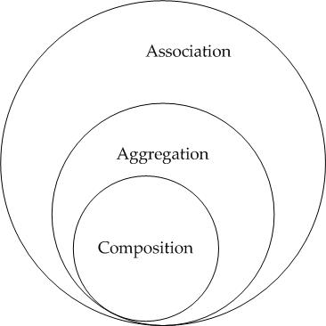

## Laravel Interview Questions

### Laravel 5.1 Changes

+ Event Broadcasting.
+ Middleware Parameters.
+ Testing Overhaul.
+ Model Factories.
+ Artisan Improvements.
+ Folder Structure.
+ Encryption.

In previous versions of Laravel, encryption was handled by the mcrypt PHP extension. However, beginning in Laravel 5.1, encryption is handled by the openssl extension, which is more actively maintained.

## Questions

(1). **What is Accessors & Mutators?**

Accessors and mutators allow you to format Eloquent attributes when retrieving them from a model or setting their value. For example, you may want to use the Laravel encrypter to encrypt a value while it is stored in the database, and then automatically decrypt the attribute when you access it on an Eloquent model.

+ [**Accessors & Mutators**](https://laravel.com/docs/5.2/eloquent-mutators#accessors-and-mutators)

(2). **What happend in 'App\Http\Requests'  Directory?**

(3). **How to create a scope in Laravel?**

Scopes allow you to define common sets of constraints that you may easily re-use throughout your application.

To define a scope, simply prefix an Eloquent model method with *scope*

+ [**Query Scopes**](https://laravel.com/docs/5.2/eloquent#query-scopes)

(4). **How to create group routes with prefix  in Laravel?**

(5). What middleware is and why it's important?

Ans: [**Middleware**](http://searchsoa.techtarget.com/answer/What-are-EAI-tools-How-are-they-used-to-build-a-middleware-part-2)

(6). IoC Container.
+ [IoC](https://laravel.com/docs/4.2/ioc)
+ [IoC](http://code.tutsplus.com/tutorials/digging-in-to-laravels-ioc-container--cms-22167)

(7). Dependency Injection in PHP.

Ans: [**Dependency Injection**](http://coderoncode.com/dependency-injection/design-patterns/programming/php/development/2014/01/06/dependency-injection-php.html)

(8) What is Inversion of Control?
Ans:
+ [IoC](http://stackoverflow.com/questions/3058/what-is-inversion-of-control)

(9). What is the difference between aggregation, composition and dependency?

+ **Aggregation** implies a relationship where the child can exist independently of the parent. Example: Class (parent) and Student (child). Delete the Class and the Students still exist.

+ **Composition** implies a relationship where the child cannot exist independent of the parent. Example: House (parent) and Room (child). Rooms don't exist separate to a House.

The above two are forms of containment (hence the parent-child relationships).

Dependency is a weaker form of relationship and in code terms indicates that a class uses another by parameter or return type.

Dependency is a form of association.
+ [Dependency1](http://php-di.org/doc/getting-started.html)
+ [Dependency2](http://code.tutsplus.com/tutorials/dependency-injection-in-php--net-28146)
+ [Dependency3](http://code.tutsplus.com/tutorials/digging-in-to-laravels-ioc-container--cms-22167)

(10). Difference between association, aggregation and composition?

+ **Association** is a relationship where all objects have their own lifecycle and there is no owner. Let’s take an example of Teacher and Student. Multiple students can associate with single teacher and single student can associate with multiple teachers, but there is no ownership between the objects and both have their own lifecycle. Both can create and delete independently.

+ **Aggregation** is a specialised form of Association where all objects have their own lifecycle, but there is ownership and child objects can not belong to another parent object. Let’s take an example of Department and teacher. A single teacher can not belong to multiple departments, but if we delete the department teacher object will not be destroyed. We can think about it as a “has-a” relationship.

+ **Composition** is again specialised form of Aggregation and we can call this as a “death” relationship. It is a strong type of Aggregation. Child object does not have its lifecycle and if parent object is deleted, all child objects will also be deleted. Let’s take again an example of relationship between House and Rooms. House can contain multiple rooms - there is no independent life of room and any room can not belong to two different houses. If we delete the house - room will automatically be deleted. Let’s take another example relationship between Questions and Options. Single questions can have multiple options and option can not belong to multiple questions. If we delete questions options will automatically be deleted.

    
# Installation
## File Permission
sudo chmod -R 777 storage/
sudo chmod -R 777 vendor/
