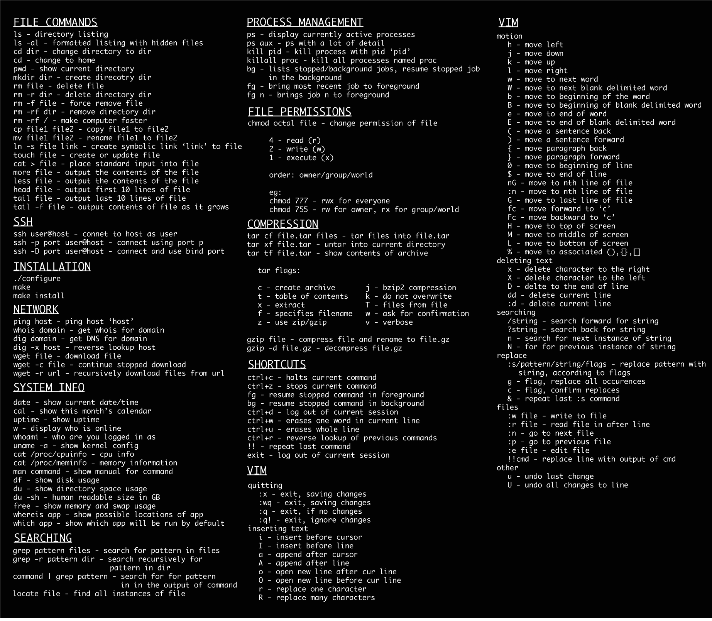

### [Bash Guide](https://github.com/Idnan/bash-guide)

### See which ports are open
netstat -ntlp | grep LISTEN

### kill a process on a port on ubuntu
sudo kill \`sudo lsof -t -i:9001\`

or

sudo kill $(sudo lsof -t -i:9001)

### To see the no. of CPU’s
lscpu

### Nginx Log
tail -f /var/log/nginx/* /var/log/php*

### linux-commands

